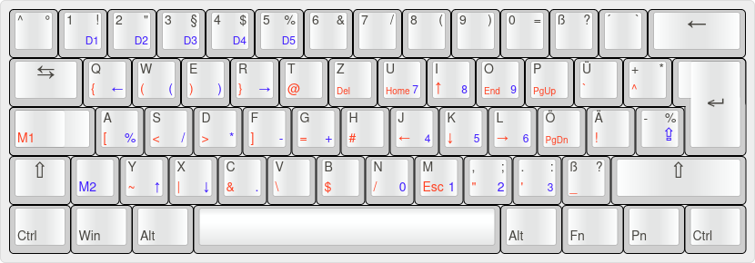
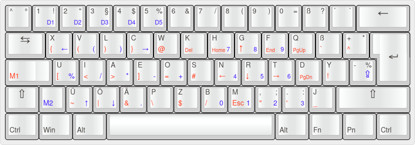

# Keyboard Layouts

This repository contains AutoHotkey scripts which change the keyboard layout

## Usage
1. Install [AutoHotkey](https://autohotkey.com/)
2. Clone the repository (`https://github.com/Nimaoth/Keyboard.git`)
3. Double click `neo/enhanced_neo.ahk`, `neo/enhanced_neo_qwertz.ahk` or `qwertz/enhanced_qwertz.ahk`

## Qwertz

## Neo
